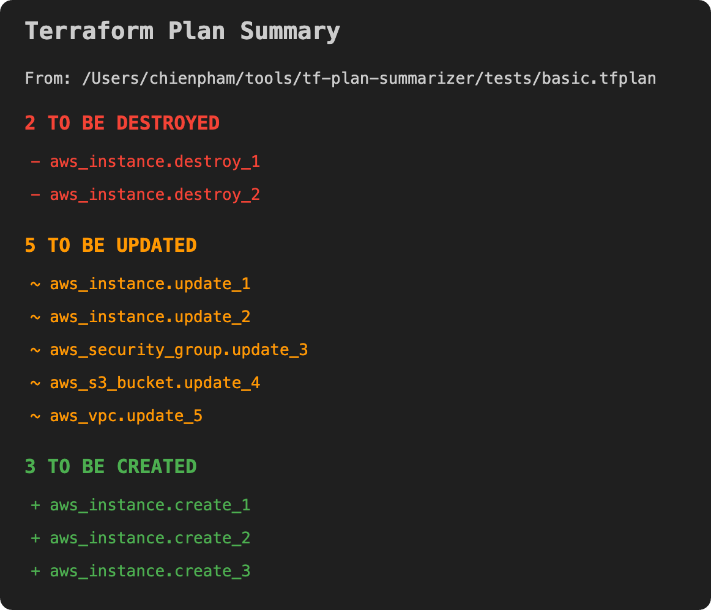
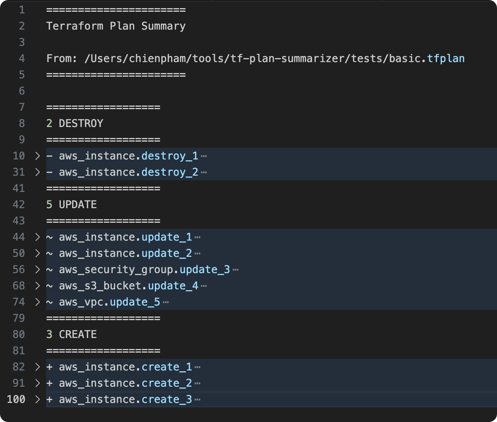
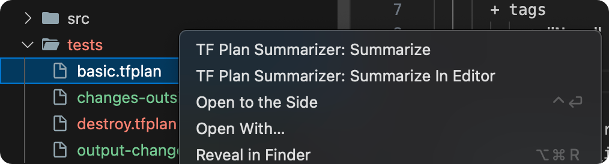

# Terraform Plan Summarizer

A Visual Studio Code extension to summarize Terraform plan outputs in a more readable way.

## Features

-   Summarizes Terraform plan outputs, highlighting resources to be created, updated, or destroyed.
-   Supports summarizing plan outputs from the active editor, selected text, or clipboard.

## Usage

1.  Run the **TF Plan Summarizer: Summarize** command from the command palette (Ctrl+Shift+P or Cmd+Shift+P).
    *   The extension will attempt to read the plan from:
        *   The current text selection
        *   The current open file
        *   The clipboard
        *   The current open file as a binary plan
    *   The extension will display a summary in a webview panel. Clicking on each item will expand/collapse the details for that specific item. Clicking on each section title will expand/collapse details of all items in that section.
      
    
      
2.  Alternatively, use the **TF Plan Summarizer: Summarize In Editor** command to display the summary in a new editor tab.
    *   This is especially helpful if you want to use `terraform` syntax highlighting and vscode editor features.
      
    
      
3. Context menus are also available when right-clicking on `.plan` or `.tfplan` files.
      
    
      

## Extension Settings

There are no settings for this extension.

## Known Issues

-   None
